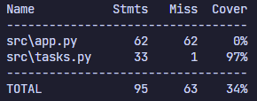
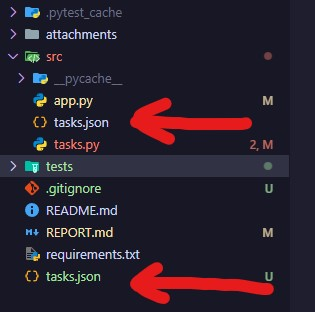
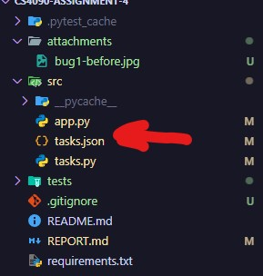
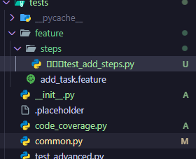
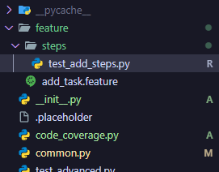

# Assignment 4: To-Do App Testing Assignment

## 1. Unit Testing

Code location: `tests/test_basic.py`

### Approach

Create at least one test per function in `tasks.py`. If the function has multiple branching possibilities (if statements, exception handling, etc.), the function will get multiple tests such that these branches are covered.

### Proof of Code Coverage



Note: Given that `app.py` is graphical interface code, there's not really an easy way of automatically testing it (unless there's a tool I don't know about). Hence, I interpretted the 90% coverage estimate as applying only to `tasks.py`. `tasks.py` contains the majority of the functionality of the app, anyway.

## 2. Bug Reporting And Fixing

### Bug 1

#### Description

The reading/writing of the `tasks.json` file is dependent on the working directory from which the app is run.

#### Before



The bottom arrow shows the `tasks.json` made when running the app from the root directory of the repository; the top arrow points to the `tasks.json` it should actually pull from.

#### After



After the fix is implemented, you can see that the original `tasks.json` file was modified instead of a new file being created.

### Bug 2

#### Description

Date comparison within the `get_overdue_tasks` function in `tasks.py` was string-based. This would have been fine for the date format that was used (probably), but if we were ever to change the format, the logic could easily break.

#### Before

Below is the function before it was changed:

```py
def get_overdue_tasks(tasks):
    """
    Get tasks that are past their due date and not completed.

    Args:
        tasks (list): List of task dictionaries

    Returns:
        list: List of overdue tasks
    """
    today = datetime.now().strftime("%Y-%m-%d")
    return [
        task
        for task in tasks
        if not task.get("completed", False) and task.get("due_date", "") < today
    ]
```

#### After

Here is the code after the changes:

```py
def get_overdue_tasks(tasks):
    """
    Get tasks that are past their due date and not completed.

    Args:
        tasks (list): List of task dictionaries

    Returns:
        list: List of overdue tasks
    """
    today = datetime.now().date()

    overdue = []

    for task in tasks:
        if not task.get("completed", False):
            due_date = task.get("due_date")
            if due_date:
                try:
                    if datetime.strptime(due_date, DATE_FORMAT).date() < today:
                        overdue.append(task)
                except ValueError as e:
                    print(f"Could not parse date: {due_date}. Does it match the format '{DATE_FORMAT}'?")

    return overdue
```

I also added global constants `DATE_FORMAT` and `TIME_FORMAT`, which I used to replace all usages of the date and time formats throughout the program.

### Bug 3

#### Description

In the `generate_unique_test_id` function of `tasks.py`, if a task is missing an ID, the program will throw an error. Ideally, this shouldn't happen in the first place, but any corruption will render the app dysfunctional.

#### Before

Below is the function before it was changed:

```py
def generate_unique_id(tasks):
    """
    Generate a unique ID for a new task.

    Args:
        tasks (list): List of existing task dictionaries

    Returns:
        int: A unique ID for a new task
    """
    if not tasks:
        return 1
    return max(task["id"] for task in tasks) + 1
```

#### After

Here is the code after the changes:

```py
def generate_unique_id(tasks):
    """
    Generate a unique ID for a new task.

    Args:
        tasks (list): List of existing task dictionaries

    Returns:
        int: A unique ID for a new task
    """
    if not tasks:
        return 1
    return max(task.get("id", 0) for task in tasks) + 1
```

### Bug 4

#### Description

Within the streamlit app code, new tasks IDs are erroneously generated using `len(tasks) + 1`. We have a `generate_unique_id` function that works as intended, but it is not being used. This bug could cause duplicate IDs if tasks are deleted.

#### Before

Here's the offending code snippet before modification:

```py
# within main() in app.py
if submit_button and task_title:
    new_task = {
        "id": len(tasks) + 1,      # <-------- ERROR
        "title": task_title,
        "description": task_description,
        "priority": task_priority,
        "category": task_category,
        "due_date": task_due_date.strftime(DATE_FORMAT),    # <--- updated in fix of Bug 3
        "completed": False,
        "created_at": datetime.now().strftime(TIME_FORMAT), # <--- updated in fix of Bug 3
    }
    tasks.append(new_task)
    save_tasks(tasks)
    st.sidebar.success("Task added successfully!")
# file continues...
```

#### After

Here is the code after the changes:

```py
# within main() in app.py
if submit_button and task_title:
    new_task = {
        "id": generate_unique_id(tasks),      # <-------- FIXED
        "title": task_title,
        "description": task_description,
        "priority": task_priority,
        "category": task_category,
        "due_date": task_due_date.strftime(DATE_FORMAT),
        "completed": False,
        "created_at": datetime.now().strftime(TIME_FORMAT),
    }
    tasks.append(new_task)
    save_tasks(tasks)
    st.sidebar.success("Task added successfully!")
# file continues...
```

### Bug 5

#### Description

Within the streamlit app code, category filter options are determined dynamically. However, if a task is missing a category, the app will crash

#### Before

Here's the offending code snippet before modification:

```py
# within main() in app.py

# Filter options
col1, col2 = st.columns(2)
with col1:
    filter_category = st.selectbox(
        "Filter by Category",
        ["All"] + list(set([task["category"] for task in tasks])),  # <---- ERROR
    )
with col2:
    filter_priority = st.selectbox(
        "Filter by Priority", ["All", "High", "Medium", "Low"]
    )
# file continues...
```

#### After

Here is the code after the changes:

```py
# within main() in app.py

 # Filter options
col1, col2 = st.columns(2)
with col1:
    filter_category = st.selectbox(
        "Filter by Category",
        ["All"]
        + list(set([task["category"] for task in tasks if "category" in task])),  # <---- FIXED
    )
with col2:
    filter_priority = st.selectbox(
        "Filter by Priority", ["All", "High", "Medium", "Low"]
    )
# file continues...
```

### Bug 6

#### Description

Some of the files in the app had invisible characters in their name, which I removed. These appeared as boxes in my file names within VSCode. I noticed and changed these immediately, so I'm unsure if they'd affect running tests or code.

#### Before



#### After

After renaming the files, the boxes were removed:


