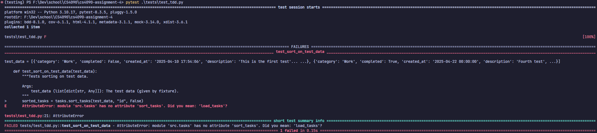
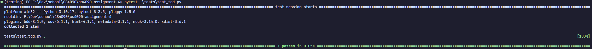

# Assignment 4: To-Do App Testing Assignment

## Running Code

Code was developed using Python 3.10.17; install requirements using `pip install -r requirements.txt`.

## 1. Unit Testing

Code location: `tests/test_basic.py`

### Approach

Create at least one test per function in `tasks.py`. If the function has multiple branching possibilities (if statements, exception handling, etc.), the function will get multiple tests such that these branches are covered.

### Proof of Code Coverage


Note: Given that `app.py` is graphical interface code, there's not really an easy way of automatically testing it (unless there's a tool I don't know about). Hence, I interpretted the 90% coverage estimate as applying only to `tasks.py`. `tasks.py` contains the majority of the functionality of the app, anyway.

## 2. Bug Reporting And Fixing

### Bug 1

#### Description

The reading/writing of the `tasks.json` file is dependent on the working directory from which the app is run.

#### Before


The bottom arrow shows the `tasks.json` made when running the app from the root directory of the repository; the top arrow points to the `tasks.json` it should actually pull from.

#### After


After the fix is implemented, you can see that the original `tasks.json` file was modified instead of a new file being created.

### Bug 2

#### Description

Date comparison within the `get_overdue_tasks` function in `tasks.py` was string-based. This would have been fine for the date format that was used (probably), but if we were ever to change the format, the logic could easily break.

#### Before

Below is the function before it was changed:

```py
def get_overdue_tasks(tasks):
    """
    Get tasks that are past their due date and not completed.

    Args:
        tasks (list): List of task dictionaries

    Returns:
        list: List of overdue tasks
    """
    today = datetime.now().strftime("%Y-%m-%d")
    return [
        task
        for task in tasks
        if not task.get("completed", False) and task.get("due_date", "") < today
    ]
```

#### After

Here is the code after the changes:

```py
def get_overdue_tasks(tasks):
    """
    Get tasks that are past their due date and not completed.

    Args:
        tasks (list): List of task dictionaries

    Returns:
        list: List of overdue tasks
    """
    today = datetime.now().date()

    overdue = []

    for task in tasks:
        if not task.get("completed", False):
            due_date = task.get("due_date")
            if due_date:
                try:
                    if datetime.strptime(due_date, DATE_FORMAT).date() < today:
                        overdue.append(task)
                except ValueError as e:
                    print(f"Could not parse date: {due_date}. Does it match the format '{DATE_FORMAT}'?")

    return overdue
```

I also added global constants `DATE_FORMAT` and `TIME_FORMAT`, which I used to replace all usages of the date and time formats throughout the program.

### Bug 3

#### Description

In the `generate_unique_test_id` function of `tasks.py`, if a task is missing an ID, the program will throw an error. Ideally, this shouldn't happen in the first place, but any corruption will render the app dysfunctional.

#### Before

Below is the function before it was changed:

```py
def generate_unique_id(tasks):
    """
    Generate a unique ID for a new task.

    Args:
        tasks (list): List of existing task dictionaries

    Returns:
        int: A unique ID for a new task
    """
    if not tasks:
        return 1
    return max(task["id"] for task in tasks) + 1
```

#### After

Here is the code after the changes:

```py
def generate_unique_id(tasks):
    """
    Generate a unique ID for a new task.

    Args:
        tasks (list): List of existing task dictionaries

    Returns:
        int: A unique ID for a new task
    """
    if not tasks:
        return 1
    return max(task.get("id", 0) for task in tasks) + 1
```

### Bug 4

#### Description

Within the streamlit app code, new tasks IDs are erroneously generated using `len(tasks) + 1`. We have a `generate_unique_id` function that works as intended, but it is not being used. This bug could cause duplicate IDs if tasks are deleted.

#### Before

Here's the offending code snippet before modification:

```py
# within main() in app.py
if submit_button and task_title:
    new_task = {
        "id": len(tasks) + 1,      # <-------- ERROR
        "title": task_title,
        "description": task_description,
        "priority": task_priority,
        "category": task_category,
        "due_date": task_due_date.strftime(DATE_FORMAT),    # <--- updated in fix of Bug 3
        "completed": False,
        "created_at": datetime.now().strftime(TIME_FORMAT), # <--- updated in fix of Bug 3
    }
    tasks.append(new_task)
    save_tasks(tasks)
    st.sidebar.success("Task added successfully!")
# file continues...
```

#### After

Here is the code after the changes:

```py
# within main() in app.py
if submit_button and task_title:
    new_task = {
        "id": generate_unique_id(tasks),      # <-------- FIXED
        "title": task_title,
        "description": task_description,
        "priority": task_priority,
        "category": task_category,
        "due_date": task_due_date.strftime(DATE_FORMAT),
        "completed": False,
        "created_at": datetime.now().strftime(TIME_FORMAT),
    }
    tasks.append(new_task)
    save_tasks(tasks)
    st.sidebar.success("Task added successfully!")
# file continues...
```

### Bug 5

#### Description

Within the streamlit app code, category filter options are determined dynamically. However, if a task is missing a category, the app will crash

#### Before

Here's the offending code snippet before modification:

```py
# within main() in app.py

# Filter options
col1, col2 = st.columns(2)
with col1:
    filter_category = st.selectbox(
        "Filter by Category",
        ["All"] + list(set([task["category"] for task in tasks])),  # <---- ERROR
    )
with col2:
    filter_priority = st.selectbox(
        "Filter by Priority", ["All", "High", "Medium", "Low"]
    )
# file continues...
```

#### After

Here is the code after the changes:

```py
# within main() in app.py

 # Filter options
col1, col2 = st.columns(2)
with col1:
    filter_category = st.selectbox(
        "Filter by Category",
        ["All"]
        + list(set([task["category"] for task in tasks if "category" in task])),  # <---- FIXED
    )
with col2:
    filter_priority = st.selectbox(
        "Filter by Priority", ["All", "High", "Medium", "Low"]
    )
# file continues...
```

### Bug 6

#### Description

Some of the files in the app had invisible characters in their names, which I removed. These appeared as boxes in my file names within VSCode. I noticed and changed these immediately, so I'm unsure if they'd affect running tests or code.

#### Before


#### After

After renaming the files, the boxes were removed:


## 3. Advanced Pytest Features

### Code Coverage

Code Location: `tests/code_coverage.py`

This file contains a function, `get_code_coverage()`, that runs all tests in the `tests` directory and measures the code coverage programmatically. The code coverage matches the result of running `pytest --cov=src tests`; however, the values for `app.py` are incorrect because of how code coverage data is collected. All other values are correct.

### Fixturs and Parameterization

Code Location: `tests/test_advanced.py`

The fixture implementation turns the `TEST_DATA` constant from `/tests/common.py` into a fixture. Parameterization includes creating similar tests as defined in `/tests/test_basic.py` but using `pytest`'s parameterization features.

## 4. Test Driven Development

### Feature: Task Sorting

This feature would allow users to sort tasks based on their properties (such as title, ID, etc.). The function would take in a list of tasks and a key to sort by, and output a sorted copy of that list of tasks. The function would take data types into account, such as dates, to ensure proper sorting. It will be comptible with filtering as well: just provide the filtered list of tasks to the sort function.

#### Initial (Failing) Test

```python
def test_sort_on_test_data(test_data):
    """Tests sorting on test data.

    Args:
        test_data (list[dict[str, Any]]): The test data (given by fixture).
    """
    sorted_tasks = tasks.sort_tasks(test_data, "id", False)

    assert sorted_tasks == sorted(test_data, key=lambda task: task["id"], reverse=True)
```

#### Proof of Failure



#### Feature Implementation

```python
def sort_tasks(tasks, sort_by, asc=True):
    """
    Sort tasks by `sort_by`.

    Args:
        tasks: The tasks to sort.
        sort_by: The key in the tasks to sort by.
        asc: True to sort ascending, False for descending. Defaults to True.

    Returns:
        list[dict[str, Any]]: The sorted tasks.
    """
    key = lambda task: task[sort_by]

    if sort_by == "due_date":
        key = lambda task: datetime.strptime(task[sort_by], DATE_FORMAT).date()
    elif sort_by == "created_at":
        key = lambda task: datetime.strptime(task[sort_by], TIME_FORMAT)

    return sorted(tasks, key=key, reverse=not asc)
```

#### Test Passing



#### Refactoring

##### First Refactor

Added more tests:

```python
@pytest.mark.parametrize(
    "sort_by,asc,expected_order",
    [
        ("id", True, range(len(TEST_DATA))),  # already sorted in this order
        ("id", False, reversed(range(len(TEST_DATA)))),
        ("due_date", True, [2, 0, 3, 1]),
        ("due_date", False, [1, 3, 0, 2]),
    ],
)
def test_sort_on_test_data(test_data, sort_by, asc, expected_order):
    """Tests sorting on complete test data.

    Args:
        test_data (list[dict[str, Any]]): The test data (given by fixture).
        sort_by (str): The property to sort by.
        asc (bool): True to sort ascending, False otherwise.
        expected_order (Iterable[int]): The indices of TEST_DATA in the expected order.
    """
    sorted_tasks = tasks.sort_tasks(test_data, sort_by, asc)

    assert sorted_tasks == [test_data[i] for i in expected_order]


@pytest.mark.parametrize(
    "task_input,sort_by,asc,expected_output",
    [
        ([], "id", True, []),
        ([{"foo": 1, "bar": "baz"}], "id", True, [{"foo": 1, "bar": "baz"}]),
    ],
)
def test_sort_edge_cases(task_input, sort_by, asc, expected_output):
    """Tests sorting on specific edge cases.

    Args:
        task_input (list[dict[str, Any]]): The test data (given manually).
        sort_by (str): The property to sort by.
        expected_output (list[dict[str, Any]]): The expected output.
    """
    sorted_tasks = tasks.sort_tasks(task_input, sort_by, asc)

    assert sorted_tasks == expected_output
```

For `test_sort_edge_cases`, the second test encountered a `KeyError` since the tasks didn't have the `id` key. To make this match the rest of the app (which effectively ignores key errors), I made the following refactor:

```python
def sort_tasks(tasks, sort_by, asc=True):
    """
    Sort tasks by key `sort_by`.

    Args:
        tasks: The tasks to sort.
        sort_by: The key in the tasks to sort by.
        asc: True to sort ascending, False for descending. Defaults to True.

    Returns:
        list[dict[str, Any]]: The sorted tasks.
    """
    missing_sort_key = []
    has_sort_key = []

    # actual for loop to avoid making two loops
    for task in tasks:
        if sort_by in task:
            has_sort_key.append(task)
        else:
            missing_sort_key.append(task)

    key = lambda task: task[sort_by]

    if sort_by == "due_date":
        key = lambda task: datetime.strptime(task[sort_by], DATE_FORMAT).date()
    elif sort_by == "created_at":
        key = lambda task: datetime.strptime(task[sort_by], TIME_FORMAT)

    return sorted(has_sort_key, key=key, reverse=not asc) + missing_sort_key
```

I thought about using `task.get(sort_by, some_default_value)`, but then choosing a default value would be tricky; what should it be? My plan was to simply append any tasks without the `sort_by` key at the end of the sorted list, which is the approach I took here.

With that in mind, I added an additional test:

```python
@pytest.mark.parametrize(
    "task_input,sort_by,asc,expected_output",
    [
        ([], "id", True, []),
        ([{"foo": 1, "bar": "baz"}], "id", True, [{"foo": 1, "bar": "baz"}]),
        (       # THE NEW TEST
            [
                {"foo": 2, "bar": "baz"},
                *[dict(id=i) for i in reversed(range(10))],
                {"foo": 1, "bar": "baz"},
            ],
            "id",
            True,
            [
                *[dict(id=i) for i in range(10)],
                {"foo": 2, "bar": "baz"},
                {"foo": 1, "bar": "baz"},
            ],
        ),
    ],
)
def test_sort_edge_cases(task_input, sort_by, asc, expected_output):
    """Tests sorting on specific edge cases.

    Args:
        task_input (list[dict[str, Any]]): The test data (given manually).
        sort_by (str): The property to sort by.
        expected_output (list[dict[str, Any]]): The expected output.
    """
    sorted_tasks = tasks.sort_tasks(task_input, sort_by, asc)

    assert sorted_tasks == expected_output

```

This test checks if the tasks with a non-matching key are rightfully placed at the end of the sorted list.
